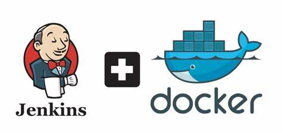

# Jenkins

  

Jenkins is an open-source automation tool that plays a key role in the world of Continuous Integration (CI) and Continuous Delivery (CD). It helps automate the process of building, testing, and deploying software, allowing developers to focus more on writing code instead of manually running each step.

At the heart of Jenkins is its ability to support DevOps practices, where development and operations teams work closely together to deliver software quickly and reliably. With Jenkins, developers can quickly see if their code works, share updates with their team, and deploy new features faster. It’s like having a robot assistant that keeps everything running smoothly, ensuring that software is built, tested, and delivered efficiently.

## Modern DevOps Practices

In today’s fast-paced software development world, automation, scalability, and consistency are crucial for delivering high-quality applications efficiently. This is where Jenkins and Docker play a vital role. As core tools in DevOps, a methodology that bridges software development and IT operations, they help streamline workflows, reduce manual effort, and accelerate software delivery.

Consider a development team working on a banking app that requires frequent updates to enhance security and functionality. Every time new code is written, it must be tested, integrated, and deployed quickly without manual intervention. Meanwhile, an e-commerce platform might need a way to package and deploy services reliably across multiple environments to ensure a seamless shopping experience. Jenkins and Docker provide the automation and consistency needed to make these processes smooth and error-free.

## What can Jenkins do?

Jenkins can help provide your DevOps team with:

***Automation: Eliminates manual steps in software deployment.***

***Continuous Integration: Detects errors early by automatically testing new code.***

***Extensibility: Supports numerous plugins for various tools and cloud services.***

***Collaboration: Teams can merge changes frequently with immediate feedback.***

# Docker

  

Docker is a containerization platform that allows developers to package applications and their dependencies into an isolated enviroment called a containers. These containers simar ot teh eher real world namesake are standardized. muach like how shipping containers are typically of simlar shape and size, Software contiainers are stnadardized to tha tensure that software runs consistently across different environments.

## What can Docker do?:

***Portability: Run applications anywhere, from local machines to cloud servers.***

***Isolation: Prevent conflicts between applications by running them in separate containers.***

***Efficiency: Uses fewer resources than traditional virtual machines.***

***Scalability: Easily scale applications by spinning up additional containers.***

## A Dynamic Devops Duo: Jenkins + Docker!

Combining Jenkins and Docker enhances automation, reliability, and scalability in DevOps workflows. Here’s why they work well together:

## Jenkins + Docker: Standardization and Isolation for DevOps Success

  

Running Jenkins inside a Docker container offers significant benefits, especially when it comes to **isolation** and **standardization**. Here's how this combination enhances your DevOps pipeline:

1. **Isolation & Standardization**  
   By running Jenkins in a Docker container, you ensure a standardized, isolated environment for your builds. This setup is more lightweight and consistent compared to running Jenkins on virtual machines or locally, using fewer resources while ensuring the same behavior across development, testing, and production.

2. **Efficiency**  
   Docker containers are far more efficient than virtual machines, allowing Jenkins to run multiple jobs concurrently without consuming excessive system resources. This makes the entire CI/CD pipeline more efficient and responsive.

3. **Security & Versioning**  
   With Docker, you can version-control your Jenkins build environments. By defining builds within Docker images, you ensure that the environment is reproducible and secure, with the ability to easily roll back to previous states when needed.

4. **Scalability**  
   Docker allows Jenkins to scale more effectively by enabling parallel job execution within isolated containers. While Jenkins itself operates as a single instance, Docker facilitates the efficient handling of multiple tasks simultaneously, improving resource utilization and overall pipeline performance.

## Useful Links:

- **Docker Official Website**: [https://www.docker.com](https://www.docker.com)
- **Jenkins Official Website**: [https://www.jenkins.io](https://www.jenkins.io)
- **Docker Hub**: [https://hub.docker.com](https://hub.docker.com)
- **Jenkins Official Docker Image on Docker Hub**: [https://hub.docker.com/_/jenkins](https://hub.docker.com/_/jenkins)
