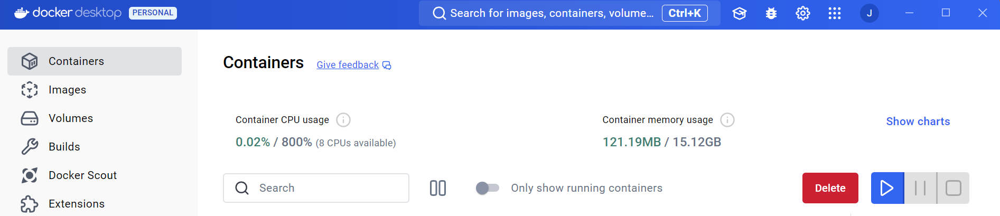

# Pre-requisites:

- **Docker and Docker Compose**: These should be installed via your operating system's package manager for the command line. For macOS/Linux, you can use [Homebrew](https://brew.sh/), and for Windows, you can use [Chocolatey](https://chocolatey.org/). Ensure both Docker and Docker Compose are installed and properly configured to manage and orchestrate containers.

- **Docker Desktop**: [Docker Desktop](https://www.docker.com/products/docker-desktop/) is available for Windows, macOS, and Linux. It provides a graphical user interface to make working with Docker containers easier, especially for beginners. Choose the appropriate version based on your operating system:
  - [Docker Desktop for Windows](https://www.docker.com/products/docker-desktop) 
  - [Docker Desktop for Mac](https://www.docker.com/products/docker-desktop) 
  - [Docker Desktop for Linux](https://www.docker.com/products/docker-desktop)

- **Docker Account**: To interact with Docker services like Docker Hub, you'll need a Docker account. This allows you to upload, share, and access Docker images from [Docker Hub](https://app.docker.com/login). Sign up or log in to use these features.
