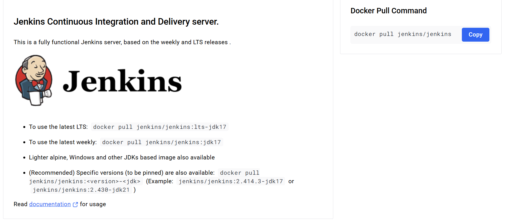
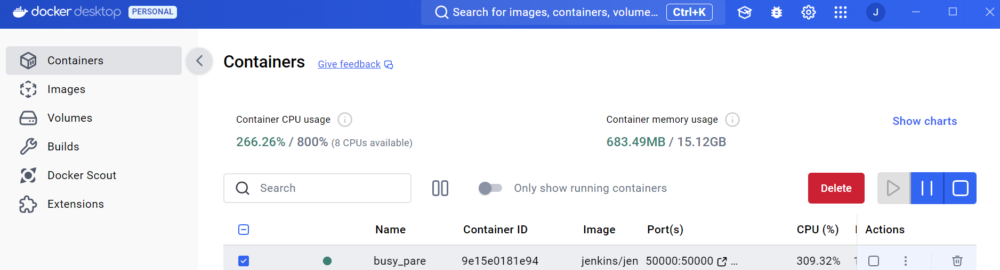
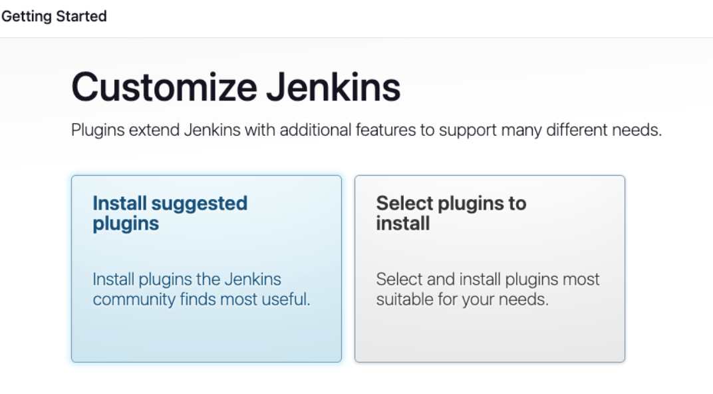

## Docker + Jenkins Setup Tutorial

### (1) Create an Account on Docker Hub
Go to [Docker Hub](https://hub.docker.com/) and sign up for an account.


After you've created your Docker Hub account, download the Docker Desktop app for your computer.

- Docker Desktop will also install Docker Compose, a tool that helps you manage multiple containers.
- You'll use Docker Hub to upload and download container images as you work with Docker.

### Check Docker Desktop Installation
Once Docker Desktop is installed, open the app and log in using your Docker Hub account.


### Confirm Docker Works in the Command Line
Open the terminal (or GitBash on Windows) and type the following command to check if Docker is installed:

`$ docker version`

This should show some details about the Docker version installed on your system.


### (2) Search for the Official Jenkins Container Image on Docker Hub
You can find the Jenkins image on Docker Hub using either the Docker Desktop app or the command line.

- **Using Docker Desktop**: Open the Docker Desktop app and search for "Jenkins".
- **Using Docker Command Line**:

`$ docker search jenkins`

This will show a list of Jenkins images. The one you need is `jenkins/jenkins` or `jenkins/jenkins:lts`. The `lts` version is the Long-Term Support (stable) version.


Click **Pull** in Docker Desktop to download the Jenkins image. After downloading, it will appear in the "Images" section of Docker Desktop.

Alternatively, run this command to download the image from the terminal:

`$ docker pull jenkins/jenkins:lts`

---

### (3) Log into Docker Hub from the Command Line
Ensure you are logged into Docker Hub, if not open your terminal (or GitBash on Windows) and enter the following command:

`$ docker login`

You'll be prompted for your Docker Hub username and password. Once logged in, you'll see a message that says "Login Succeeded".


---

### (4) Run Jenkins in a Docker Container
Now that you're logged in, use this command to run Jenkins in a Docker container:

`$ docker run -p 8080:8080 -p 50000:50000 -v jenkins_home:/var/jenkins_home jenkins/jenkins:lts-jdk11`


What this command does:
  - Starts a Jenkins container.
  - Maps port `8080` and `50000` on your machine to the same ports in the container.
  - Creates a volume named `jenkins_home` to store Jenkins data.
  - Uses the `jenkins:lts-jdk11` image to run Jenkins (older alternate version).

### Note: Slightly modified alternative version:

- **Command 1:** `docker run -p 8080:8080 -p 50000:50000 --restart=on-failure -v jenkins_home:/var/jenkins_home jenkins/jenkins:lts-jdk17`
  - Uses **JDK 17**, includes **auto-restart** on failure.

- **Command 2:** `docker run -p 8080:8080 -p 50000:50000 -v jenkins_home:/var/jenkins_home jenkins/jenkins:lts-jdk11`
  - Uses **JDK 11**, **no auto-restart**.

***Explanation:** JDK 11 is more stable with older plugins, while JDK 17 may have compatibility issues. Auto-restart ensures uptime but isn't mandatory.**


---

### (5) Find the Jenkins Admin Password
After Jenkins starts, you’ll need the initial admin password to log in.

The password will be displayed in the terminal upon a ssucessful execution:


Alternitively:

- The password is stored in the container at: `/var/jenkins_home/secrets/InitialAdminPassword`.

---
### Verification:

Note: A this point you should see the actual container running in the terminal via the following command:

`docker ps` 

You should also see the running contianer present in the the Docker Desktop GUI in the "Containers" section:



### Note:

***There are Two Port Mappings!***

- **Port 8080:** Exposes Jenkins' web interface on the host machine's port 8080, which maps internally to the container's port 8080.
- **Port 50000:** Used for Jenkins agent connections, exposed on host's port 50000, mapping to container’s port 50000.

### (6) Access Jenkins in a Web Browser
Open a web browser and go to [http://localhost:8080](http://localhost:8080).

You’ll be asked for the admin password you just located.

***Note: You have the ability to change the intially provided password as needed.***

---

As Jenkins begins to load up you will see a
**Get Started**  screen. 


Be sure to select the 
**Install Suggested Plugins** option.



Continue to wait as this process may take a few moments

You will be promtted to create an **Admin User** account. A this point you will create a username and password ***be sure to document it and keep it safe! You will need it to login for future acessibility ***


---

### (7) Install Custom Plugins As Needed

Navigate to **Manage Jenkins** on the menu located on the left side of your Jenkins dashboard.

Scroll down until you see the word **plugins**


Simply select **Availble Plugins** from the menu and type in the name of the plugin you need to view the list of plugin downloads.

You may choose the plugins that best serve your use case. The following representative of AWS GCP enviroments along with a few for GIT and Terraform:


### Plugins:
```txt
AWS
AWS Credentials
Pipeline
Amazon EC2
Amazon Elastic Container Service
AWS Code Deploy
AWS Lambda
AWS S3 Bucket Credentials
AWS CodeBuild
AWS CodePipeline
AWS Secrets Manager Secret Source
Configuration as Code
CloudFormation
AWS SAM
Terraform
Google
Kubernetes
Google Cloud Storage
Google Cloud SDK
Pipeline
Snyk
SonarQube Scanner
Aqua - all 3
GitHub
GitHub Integration
GitHub Authentication
Pipeline GitHub
Pipeline GitHub Notify Step
```
### Search Availiable Plugins: (Organized by application)
```txt
AWS
-AWS Credentials
-Pipeline: AWS Steps
-Amazon EC2
-Amazon Elastic Container Service (ECS) / Fargate 
-Amazon S3 Bucket Credentials 
-AWS CodeBuild
-AWS CodeDeploy
-AWS Lamnda 
-AWS CodePipeline 
-AWS Secrets Manager SecretSource 
-Configuration as Code AWS SSM secrets
-CloudFormation 
-AWS SAM

Terraform
-Terraform

Google
-Kubernetes
-Google Cloud Storage
-Google Kubernetes Engine
-Google Cloud Platform SDK::Auth
-Pipeline: GCP Steps

DevSecOps
-Snyk Securityﾠ

Sonar 
-SonarQube Scannerﾠ

Aqua
-Aqua Security Scannerﾠ 
-Aqua MicroScannerﾠ
-Aqua Security Serverless Scannerﾠ

GitHub
-GitHub Integration
-GitHub Authentication
-Pipeline: GitHub
-Pipeline GitHub Notify Step
```
---

### Jenkins Server is Ready for Your First Build!

Now that Jenkins is set up and running, it’s time to get started with your first build.

- You have successfully created a Jenkins user and set up the Jenkins URL (typically `http://localhost:8080`).
- Jenkins has installed the recommended plugins and is ready to begin integrating with your projects.

### Access the Jenkins Dashboard
Remember: To start using Jenkins, go to [http://localhost:8080](http://localhost:8080) in your web browser.

You will enter your credentials. 
From there, you can start creating Jenkins jobs, adding build pipelines, and automating your development workflows.

Your Jenkins server is now ready to start building!
